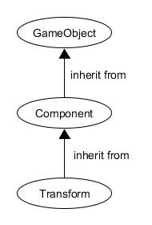

## 游戏对象 (GameObjects)
游戏对象 (GameObjects) 是一种容器, 本身不做任何事情. 它们需要特殊属性 (special properties) 才能发挥游戏设计者想要实现的功能.

## 资源 (Assets)
具有一定功能的部件, 比如贴图, 模型, 代码等等.

## 二者的联系
我们可以将资源应用到游戏对象上, 让游戏对象可以实现多种功能.

## 游戏案例
### roll a ball
#### 资源的目录组织结构
分为 素材(materials)、 预设(prefabs)、 脚本(script) 三个文件目录
#### 游戏对象树的层次结构
光,地面,玩家,摄像机,墙壁,物品,Canvas(绘制文本),事件系统
可以归纳为 摄像机, 布景元素, 控制元素, 事件系统 这几大类.
其中若是有重复元素, 则存放在一个父对象之下

## 验证 MonoBehaviour 基本行为或事件触发
```
    //当一个脚本实例被载入时Awake被调用。
    void Awake() {
        Debug.Log("Awake!");
    }

    // Use this for initialization
    void Start () {
        Debug.Log("Start!");
    }
    
    // Update is called once per frame
    void Update () {
        Debug.Log("Update!");
    }

    //This function is called every fixed framerate frame, if the MonoBehaviour is enabled
    void FixedUpdate () {
        Debug.Log("FixedUpdate!");
    }

    //LateUpdate is called every frame, if the Behaviour is enabled
    void LateUpdate () {
        Debug.Log("LateUpdate!");
    }

    //渲染和处理GUI事件时调用
    void OnGUI () {
        Debug.Log("GUI!");
    }

    //当对象变为不可用或非激活状态时此函数被调用
    void OnDisable () {
        Debug.Log("OnDisable!");
    }

    //当对象变为可用或激活状态时此函数被调用
    void OnEnable () {
        Debug.Log("OnEnable!");
    }
```

## 了解对象
### GameObject
```
GameObjects are the fundamental objects in Unity that represent characters, props and scenery. 
They do not accomplish much in themselves but they act as containers for Components, which implement the real functionality.
```
GameObject 是Unity中的基本对象, 它可以表现为人物, 道具和风景. 他们自身并没有什么用处, 但能充当组件(Components)的容器, 实现一定的功能.

### Transform
```
The Transform component determines the Position, Rotation, and Scale of each object in the scene. 
Every GameObject has a Transform.
```
Transform组件决定了每个对象的位置, 角度和缩放比例. 每个游戏对象(GameObject)都有一个 Transform组件.

### Component
```
Base class for everything attached to GameObjects.
```
一切附加到游戏物体的基类.

### table
#### GameObject的属性
activeSelf 标识游戏物体是否是活动的. 使这个游戏物体活动/不活动
isStatic 只有在API指定一个游戏物体是静态的时候编辑
tag 游戏对象的标签
layer 游戏物体所在的层. 一个层的范围是在[0...32]之间
Prefabs 预设(未找到)

#### Transform的属性
position 在世界空间坐标的位置
rotation 在世界空间坐标物体变换的旋转角度作为Quaternion储存
Scale 缩放比例(1为原始大小)

#### table的部件
有 transform, Mesh Filter, Box Collider, Mesh Renderer和Default-Material

### 三者的关系(UML图)


## 技术

### 查找对象

1.通过对象名称（Find方法）
```
var tar = GameObject.Find("/name");
// 也可以是一个路径
```
2.通过标签获取单个游戏对象（FindWithTag方法）
```
var tar = GameObject.FindWithTag("tag");
// 返回一个对象
```
3.通过标签获取多个游戏对象（FindGameObjectsWithTags方法）
```
var tar = GameObject.FindGameObjectsWithTag("tag");
// 返回一个对象列表
```
4.通过类型获取单个游戏对象（FindObjectOfType方法）
```
var tar = GameObject.FindObjectOfType("type");
// 返回一个对象
```
5.通过类型获取多个游戏对象（FindObjectsOfType方法）
```
var tar = GameObject.FindObjectsOfType("type");
// 返回一个对象列表
```

### 添加子对象
(parent属性)
### 遍历对象树
### 清除所有子对象

## 资源预设(Prefabs)与 对象克隆(clone)

### 预设的好处
### 预设和克隆的关系
### 预制资源实例化示例

## 组合模式(Composite Pattern / 一种设计模式)

## 使用BroadcastMessage()方法向子对象发送消息


